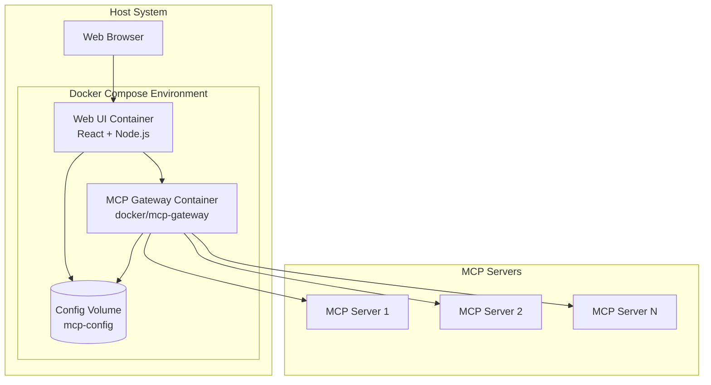

# 設計書

## 概要

Docker MCP Gateway Web GUIは、MCPサーバーの管理を簡素化するためのWebベースのアプリケーションです。このシステムは、Docker MCP Gatewayと統合し、ユーザーがブラウザを通じてMCPサーバーの設定、監視、テストを行えるようにします。アプリケーションは完全にコンテナ化され、React/Next.jsフロントエンドとNode.js/Express.jsバックエンドで構成されます。

## アーキテクチャ

### システム構成



### 技術スタック

**フロントエンド:**
- React 18 with TypeScript
- Next.js 14 (App Router)
- Tailwind CSS for styling
- React Query for state management
- Socket.io-client for real-time updates

**バックエンド:**
- Node.js 20 LTS
- Express.js with TypeScript
- Socket.io for real-time communication
- Docker SDK for Node.js
- JSON Schema validation

**インフラストラクチャ:**
- Docker Compose for orchestration
- Nginx for reverse proxy (optional)
- Volume mounts for configuration persistence

## コンポーネントとインターフェース

### フロントエンドコンポーネント

#### 1. ダッシュボードコンポーネント
```typescript
interface DashboardProps {
  servers: MCPServer[];
  onServerToggle: (serverId: string, enabled: boolean) => void;
  onServerTest: (serverId: string) => void;
}
```

#### 2. サーバー設定エディタ
```typescript
interface ServerConfigEditorProps {
  server: MCPServer;
  config: MCPServerConfig;
  onConfigSave: (config: MCPServerConfig) => void;
  onConfigValidate: (config: string) => ValidationResult;
}
```

#### 3. サーバーカタログ
```typescript
interface ServerCatalogProps {
  availableServers: CatalogServer[];
  installedServers: string[];
  onServerInstall: (serverId: string, config?: any) => void;
}
```

#### 4. ログビューア
```typescript
interface LogViewerProps {
  serverId: string;
  logs: LogEntry[];
  onLogRefresh: () => void;
  realTimeEnabled: boolean;
}
```

### バックエンドAPI

#### 1. サーバー管理API
```typescript
// GET /api/servers - すべてのMCPサーバーを取得
interface GetServersResponse {
  servers: MCPServer[];
  status: 'success' | 'error';
}

// POST /api/servers/:id/toggle - サーバーの有効/無効を切り替え
interface ToggleServerRequest {
  enabled: boolean;
}

// PUT /api/servers/:id/config - サーバー設定を更新
interface UpdateConfigRequest {
  config: MCPServerConfig;
}
```

#### 2. テストAPI
```typescript
// POST /api/servers/:id/test - サーバー機能をテスト
interface TestServerRequest {
  testType: 'connection' | 'tools' | 'resources';
  parameters?: any;
}

interface TestServerResponse {
  success: boolean;
  results: TestResult[];
  errors?: string[];
}
```

#### 3. カタログAPI
```typescript
// GET /api/catalog - 利用可能なサーバーカタログを取得
interface GetCatalogResponse {
  servers: CatalogServer[];
  categories: string[];
}

// POST /api/catalog/install - カタログからサーバーをインストール
interface InstallServerRequest {
  serverId: string;
  config?: MCPServerConfig;
}
```

### Docker MCP Gateway統合

#### Gateway通信インターフェース
```typescript
interface GatewayClient {
  // Gateway APIとの通信
  getServerStatus(serverId: string): Promise<ServerStatus>;
  updateServerConfig(serverId: string, config: MCPServerConfig): Promise<void>;
  restartServer(serverId: string): Promise<void>;
  testServerConnection(serverId: string): Promise<TestResult>;
}

// Docker MCP Gateway APIエンドポイント
interface GatewayAPI {
  baseUrl: string; // http://mcp-gateway:8080
  endpoints: {
    servers: '/api/v1/servers';
    config: '/api/v1/config';
    health: '/api/v1/health';
    logs: '/api/v1/logs';
  };
}
```

## データモデル

### MCPサーバーモデル
```typescript
interface MCPServer {
  id: string;
  name: string;
  description: string;
  version: string;
  status: 'running' | 'stopped' | 'error' | 'starting';
  enabled: boolean;
  config: MCPServerConfig;
  lastUpdated: Date;
  healthCheck?: HealthCheckResult;
}

interface MCPServerConfig {
  image: string;
  ports?: PortMapping[];
  environment?: Record<string, string>;
  volumes?: VolumeMapping[];
  command?: string[];
  args?: string[];
  resources?: ResourceLimits;
}

interface HealthCheckResult {
  status: 'healthy' | 'unhealthy' | 'unknown';
  lastCheck: Date;
  message?: string;
  responseTime?: number;
}
```

### カタログモデル
```typescript
interface CatalogServer {
  id: string;
  name: string;
  description: string;
  category: string;
  image: string;
  version: string;
  tags: string[];
  documentation?: string;
  configSchema?: JSONSchema;
  requirements?: ServerRequirements;
}

interface ServerRequirements {
  minMemory?: string;
  minCpu?: string;
  requiredPorts?: number[];
  dependencies?: string[];
}
```

### 設定管理モデル
```typescript
interface GatewayConfig {
  version: string;
  servers: Record<string, MCPServerConfig>;
  global: {
    logLevel: 'debug' | 'info' | 'warn' | 'error';
    maxLogSize: string;
    healthCheckInterval: number;
  };
}
```

## エラーハンドリング

### エラー分類
1. **設定エラー**: JSON構文エラー、スキーマ検証エラー
2. **接続エラー**: Gateway通信エラー、サーバー接続エラー
3. **実行時エラー**: サーバー起動エラー、リソース不足エラー
4. **認証エラー**: 権限不足、認証失敗

### エラー処理戦略
```typescript
interface ErrorHandler {
  // グローバルエラーハンドラ
  handleGlobalError(error: Error, context: string): void;
  
  // API エラーハンドラ
  handleAPIError(error: APIError): ErrorResponse;
  
  // バリデーションエラーハンドラ
  handleValidationError(errors: ValidationError[]): ValidationResponse;
}

interface ErrorResponse {
  success: false;
  error: {
    code: string;
    message: string;
    details?: any;
    suggestions?: string[];
  };
}
```

### ユーザーフレンドリーなエラーメッセージ
- JSON構文エラー: 行番号と具体的な修正提案を表示
- サーバー接続エラー: 接続状態の確認手順を提供
- 設定エラー: 有効な設定例を表示

## テスト戦略

### 単体テスト
- **フロントエンド**: Jest + React Testing Library
- **バックエンド**: Jest + Supertest
- **カバレッジ目標**: 80%以上

### 統合テスト
- Docker Compose環境でのE2Eテスト
- Playwright for browser automation
- Gateway APIとの統合テスト

### テストシナリオ
1. **サーバー管理フロー**
   - サーバーの有効化/無効化
   - 設定の編集と保存
   - サーバーの再起動

2. **設定管理フロー**
   - JSON設定の検証
   - 設定ファイルの読み込み/保存
   - 設定変更の反映

3. **テスト機能フロー**
   - サーバー接続テスト
   - ツール機能テスト
   - エラー状態の処理

### パフォーマンステスト
- 大量のサーバー（50+）での動作確認
- リアルタイム更新の負荷テスト
- メモリ使用量の監視

## セキュリティ考慮事項

### 認証・認可
```typescript
interface AuthConfig {
  enabled: boolean;
  provider: 'local' | 'oauth' | 'ldap';
  sessionTimeout: number;
  requireHTTPS: boolean;
}

interface UserPermissions {
  canViewServers: boolean;
  canEditConfig: boolean;
  canManageServers: boolean;
  canInstallServers: boolean;
}
```

### 入力検証
- すべてのJSON入力のスキーマ検証
- ファイルパスのサニタイゼーション
- SQLインジェクション対策（該当する場合）

### コンテナセキュリティ
- 非rootユーザーでの実行
- 最小権限の原則
- セキュリティスキャンの実装

### ネットワークセキュリティ
- HTTPS強制（本番環境）
- CORS設定の適切な管理
- レート制限の実装

## デプロイメント設計

### Docker Compose構成
```yaml
version: '3.8'
services:
  web-ui:
    build: .
    ports:
      - "3000:3000"
    environment:
      - NODE_ENV=production
      - GATEWAY_URL=http://mcp-gateway:8080
    volumes:
      - mcp-config:/app/config
    depends_on:
      - mcp-gateway

  mcp-gateway:
    image: docker/mcp-gateway:latest
    ports:
      - "8080:8080"
    volumes:
      - mcp-config:/config
      - /var/run/docker.sock:/var/run/docker.sock

volumes:
  mcp-config:
```

### 環境変数設定
```typescript
interface EnvironmentConfig {
  NODE_ENV: 'development' | 'production';
  PORT: number;
  GATEWAY_URL: string;
  LOG_LEVEL: string;
  CONFIG_PATH: string;
  ENABLE_AUTH: boolean;
  SESSION_SECRET: string;
}
```

### ヘルスチェック
- アプリケーションの起動状態確認
- Gateway接続状態の監視
- 設定ファイルの整合性チェック